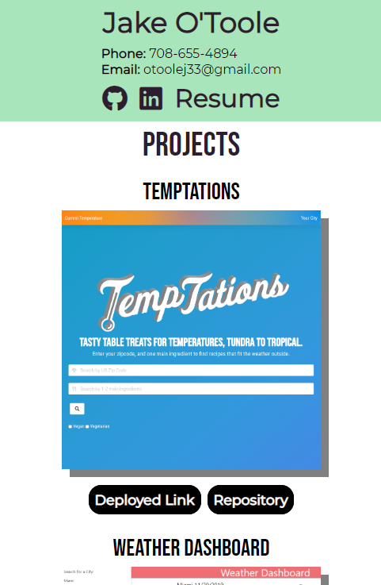
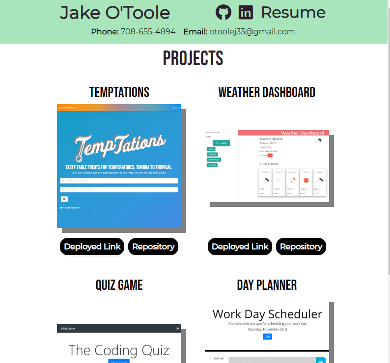

# portfolio-part-deux

## Description 
This is the third homework assignment that revolved around creating a portfolio. The first was based on a provide image for layout requirements and was done with flex. The second was based on the same image for layout and we had to use bootstrap. This assignment had no requirements around how the layout had to look or what we could use for styling. I choose to try and do all custom CSS to practice CSS grid for the first time.

## Live site: 
https://sirpotatoiv.github.io/portfolio-part-deux/

## Images
Mobile Display:

Medium Display and Larger:

## Installation 
If all files are kept in a single folder a web browser should be able to run the project and you have an internet connection.

## Usage 
This was primarily made to meet the requirements of a homework assignment and create a portfolio. It could be used as a template for a portfolio.

## Credits 
I created this code based on the homework prompt created by Triology Education Services. Certain pieces of code I used online resources for help. I have included citations in the form of comments throughout the html and css. In addition, Jen Kramer's (https://github.com/jen4web) course "CSS Grids and Flexbox for Responsive Web Design" on Frontend Masters helped me a great deal with a better understanding of CSS flex and grid.

## Contributing 
I was the only one to work on this project, but of course I had help from my instructor, TA's, and classmates.

## Challenges
I decided to try css grid for the first time as part of this homework assignment. I had not used CSS grid in the past, so it was a challenge utilizing it for the first time. At first I used grid heavily to lay out each individual object. I later switched to a combination of both grid and flex. I am still in the early stages of comprehending grid, when to use flex with grid, etc. In addition, since I was no longer using a framework like Bootstrap I had to build the responsive in myself, which was also new for me.

## License
[MIT](https://choosealicense.com/licenses/mit/)
